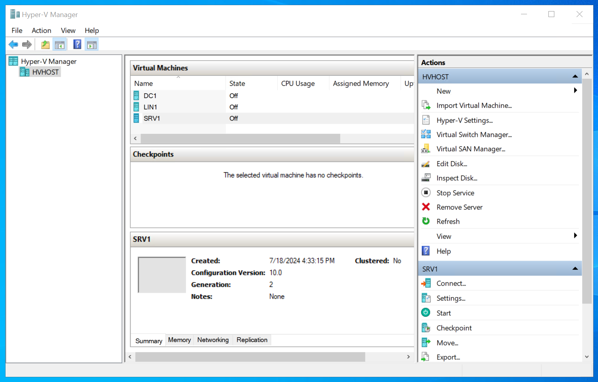
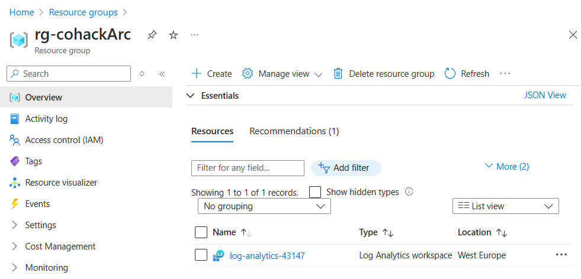

# MTT CoHack Challenge: Azure Arc

## Introduction

In this challenge-based hackathon, we will work together to explore Azure Arc to manage your resources across on-premises, multi-cloud, and edge environments. 

Your challenge is to deploy Azure Arc and onboard servers in an on-premises datacenter to Azure Arc. You will also explore the capabilities of Azure Arc and learn how to manage your resources at scale.

## Requirements

- Your coaches will give you login details to an Azure VM HVHOST, running a Hyper V environment with a simulated on-premises datacenter
  - DC1: Domain Controller running Windows Server 2022 without GUI
  - SRV1: Windows Server 2022 with SQL Server 2022
  - LIN1: Ubuntu Linux 24.04
- Your coaches will also give you login details to an Azure subscription with a resource group called rg-cohackArc. Please create all resources in this resource group.
- The resource group rg-cohackArc contains a log analytics workspace called log-analytics-\<xxxxx>. Please use this workspace for any tasks that require monitoring.

## Learning Objectives

This hack will help you learn how to:

- Onboard on-prem servers to Azure Arc using different methods
- Enable monitoring and insights for on-prem servers using Azure Arc
- Manage and govern your on-prem resources at scale using Azure Policies
- Add extensions to Arc-enabled machines
- Use Defender for Cloud to get recommendations for your on-prem servers
- Change SQL configuration settings on an Arc-enabled SQL Server
- Manage updates from the cloud

## Success Criteria

### Challenge 1: Onboard on-prem servers to Azure Arc

- Connect to HVHOST and power on your data center servers
- Onboard SRV1 to Azure Arc from the Windows GUI using an interactive tool or script
- Onboard DC1 to Azure Arc from the Windows GUI using a script that does not prompt for user input
- Onboard the LIN1 server to Azure Arc using the Azure CLI

#### Resources

- [Azure Arc Overview](https://learn.microsoft.com/en-us/azure/azure-arc/overview)
- [Onboarding servers](https://learn.microsoft.com/en-us/azure/azure-arc/servers/overview)
- Supported regions for [Arc-enabled SQL Servers](https://learn.microsoft.com/en-us/sql/sql-server/azure-arc/prerequisites?view=sql-server-ver16&tabs=azure#supported-regions)
- Deploy a sandbox showcasing all Arc features and explore Azure Stack HCI [ArcBox/HCIBox](https://learn.microsoft.com)
- Arc SQL Dashboard on [Github](sql-server-samples/samples/features/azure-arc/dashboard/README.md)

### Challenge 2: Manage and govern your on-prem resources at scale

- Enable Insights for all Arc-enabled servers using the available Log Analytics workspace, icluding process data and network connections
- Create an Azure Policy that enforces a tag on all Arc-enabled servers
- Add an extension to SRV1 that enables SSH connections, test the connection
- Use Azure Update Manager to manage updates on all Arc-enabled servers
  - check for missing updates
  - schedule updates

#### Resources

- [Azure Policy for Arc-enabled servers](https://learn.microsoft.com/en-us/azure/azure-arc/servers/policy-reference)
- [Azure Update Manager](https://learn.microsoft.com/en-us/azure/update-manager/overview)
- [SSH access to Azure Arc-enabled servers](https://learn.microsoft.com/en-us/azure/azure-arc/servers/ssh-arc-overview?tabs=azure-powershell)

### Challenge 3: Use Defender for Cloud to get recommendations for your on-prem servers

- Enable Defender for Cloud on all Arc-enabled servers
- review recommendations for your servers later

#### Resources

- [Connect non-Azure machines to Defender for Cloud](https://learn.microsoft.com/en-us/azure/defender-for-cloud/quickstart-onboard-machines)

### Challenge 4: manage your SQL Server using Azure Arc from the Azure portal

- switch SRV1 SQL authentication to Entra ID
- change SRV1 licensing to pay-as-you-go
- run a SQL migration assessment
- run a SQL best practices assessment

#### Resources

- [SQL Server enabled by Azure Arc](https://learn.microsoft.com/en-us/sql/sql-server/azure-arc/overview?view=sql-server-ver16)